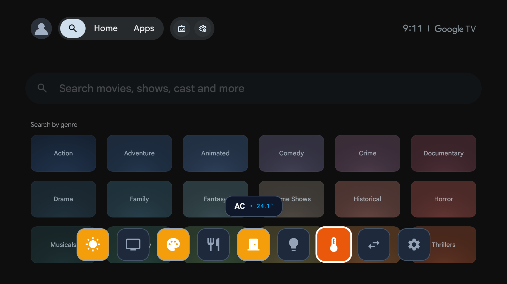
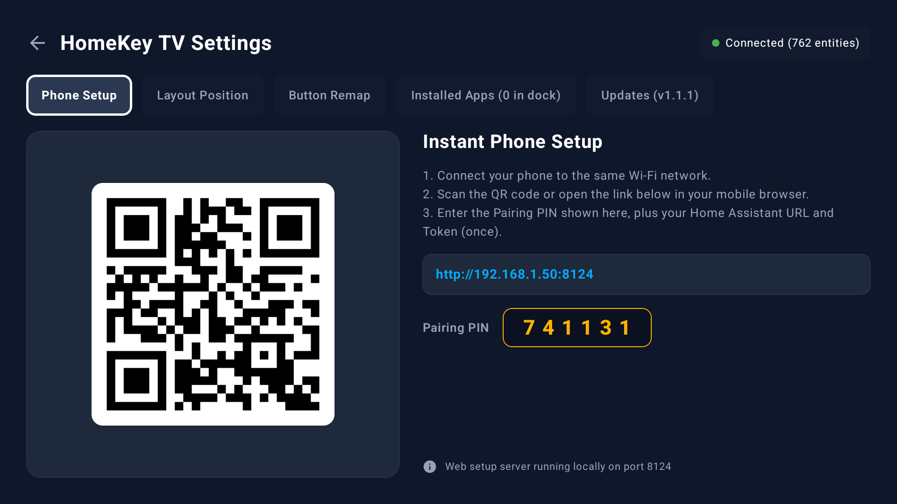
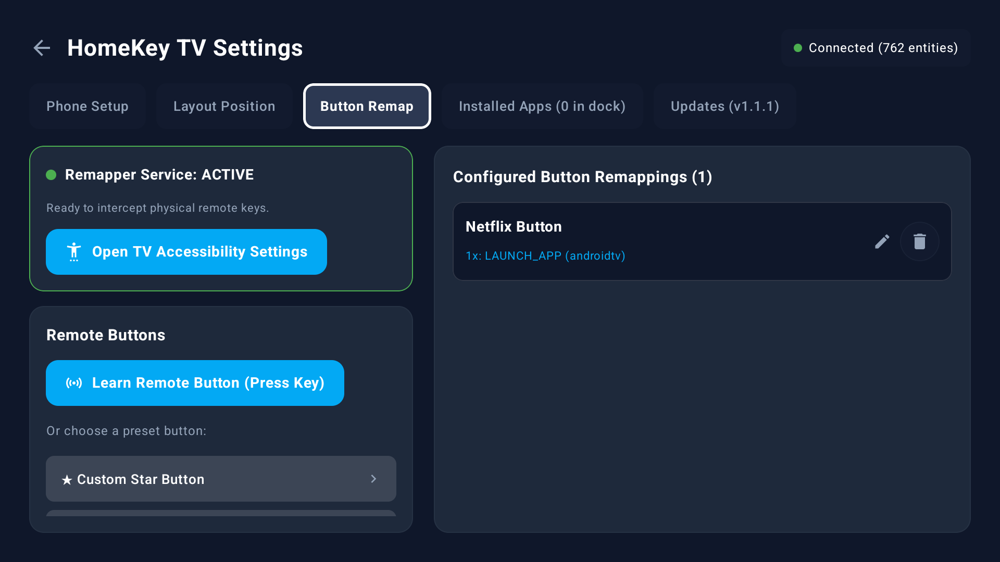
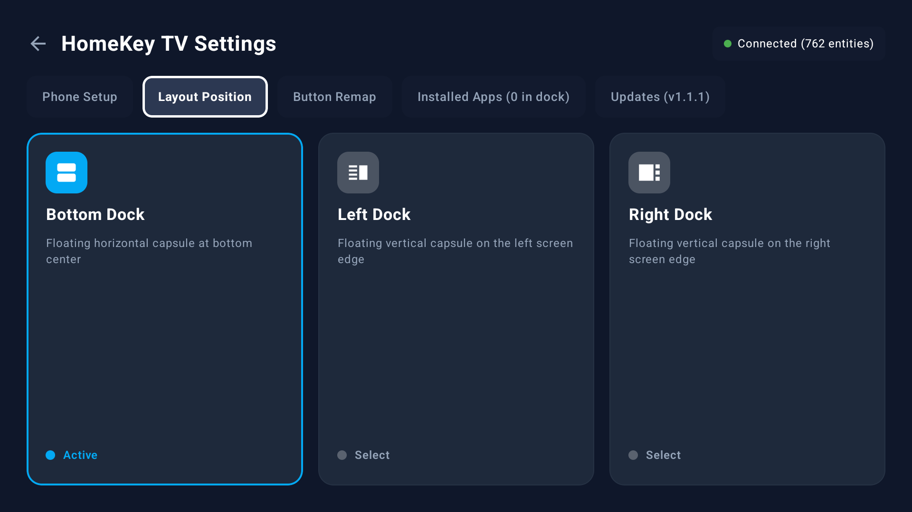
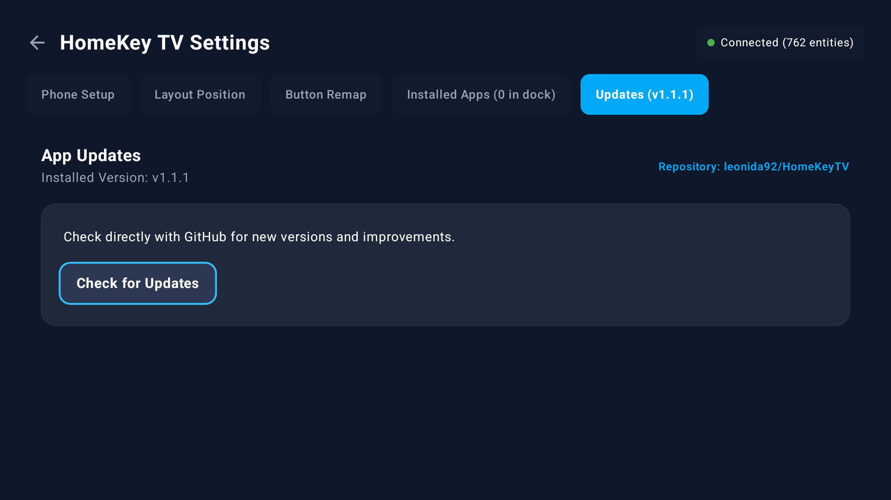

# HomeKey TV

<p align="center">
  <strong>Fast, lightweight Jetpack Compose quick-access dock and remote button remapper for Google TV and Android TV, seamlessly integrated with Home Assistant.</strong>
</p>

<p align="center">
  
  
  
  
</p>

---

## Screenshots

<p align="center">
  
  <br>
  <em>Floating Quick-Access Dock with dynamic state badge over Google TV</em>
</p>

<p align="center">
  
  
</p>
<p align="center">
  
  
</p>

---

## Features

- **Floating Quick-Access Dock**:
  - Customizable dock positioning: Bottom Dock, Left Dock, or Right Dock.
  - Solid, high-contrast tiles and badges designed for TV readability over any background or active video stream.
  - Interactive popup dialogs for light brightness adjustment (0–100%) and climate controls (temperature and HVAC modes).
  - Pin installed Android TV apps directly alongside Home Assistant entities.

- **Native Remote Button Remapper**:
  - Intercept and remap any remote button (e.g. Netflix, YouTube, Color Keys, Guide, Live TV) using an isolated, non-blocking `AccessibilityService`.
  - Independent Single-Press, Double-Press, and Long-Press triggers per keycode.
  - Remap to actions: Open Dock, Toggle Light/Switch, Run Scene/Script, Launch TV App, or Put TV to Sleep.

- **Instant Phone Web Setup (Port 8124)**:
  - Built-in lightweight local web server with QR code for instant pairing on mobile or desktop browsers.
  - Search, filter, and multi-select entities from your Home Assistant instance.
  - Custom Entity Renaming: Set custom display names directly in the web UI.
  - Custom Icon Picker: Choose from an extensive Material icon gallery.
  - Automatic credential persistence in browser storage for instant, hassle-free updates.

- **In-App GitHub Update Checker**:
  - Direct integration with GitHub Releases to check for latest updates.
  - Semantic version checking and release notes display.
  - Direct APK download and automated prompt for Android TV Package Installer.

- **Security and Hardened Architecture**:
  - Long-Lived Access Tokens stored in `EncryptedSharedPreferences` backed by the hardware Android Keystore.
  - 6-digit dynamic pairing PIN with automated brute-force rate-limiting and temporary lockouts.
  - Entity fetching proxied exclusively to your verified Home Assistant server (SSRF protection).
  - `allowBackup="false"` to prevent token extraction via ADB or cloud backups.

- **Hardware-Accelerated Smoothness**:
  - Optimized for low-power quad-core TV chipsets (e.g. MediaTek Cortex-A55).
  - Isolated Compose state holders to eliminate root layout recomposition on D-pad navigation.
  - RenderNode scaling via `Modifier.graphicsLayer` and memoized icon vector parsing for steady 60fps operation.

---

## Architecture and Tech Stack

- **UI Framework**: [Jetpack Compose](https://developer.android.com/jetpack/compose) for Leanback and Android TV.
- **Async and Reactive**: Kotlin Coroutines and `StateFlow` reactive pipelines.
- **Home Assistant Communication**:
  - **WebSocket Client**: Real-time bidirectional connection (`HAWebSocketClient`) with exponential backoff and automatic event resubscription.
  - **REST Client**: OkHttp for entity fetching and service calls.
- **Embedded Web Server**: [NanoHTTPD](https://github.com/NanoHttpd/nanohttpd) for local network phone pairing.
- **System Hooking**: Android `AccessibilityService` (`RemoteButtonRemapService`) for native keycode capture and TV power controls.
- **Storage**: Android Jetpack `EncryptedSharedPreferences` and `Security-Crypto`.

---

## Installation

### Option 1: Sideload via ADB (Recommended)

1. Enable Developer Options and Network Debugging on your Google TV / Android TV (`Settings > System > About > Build` — tap 7 times).
2. Connect to your TV via ADB:
   ```bash
   adb connect <TV_IP_ADDRESS>:5555
   ```
3. Install the Release APK:
   ```bash
   adb install -r HomeKeyTV-v1.1.1.apk
   ```

### Option 2: Sideload via File Manager
Transfer the APK to your TV using a USB drive or local network sharing app (e.g., Send Files to TV), then install via a TV file manager.

---

## Setup Guide

1. Launch HomeKey TV from your TV apps list or Leanback launcher.
2. Open Settings (gear icon on the dock or from the app drawer).
3. Select Instant Phone Setup:
   - Scan the on-screen QR Code or navigate to `http://<TV_IP>:8124` in your mobile browser.
   - Enter the 6-digit Pairing PIN shown on the TV screen.
   - Provide your Home Assistant URL (e.g. `http://192.168.1.100:8123` or Nabu Casa URL) and a Long-Lived Access Token (created in Home Assistant under `Profile > Long-Lived Access Tokens`).
4. Choose and Customize Entities:
   - Select entities to display on your dock.
   - Edit custom display names and select custom icons.
   - Tap Save Configuration to TV.

### Setting Up Remote Button Remapping

1. In the TV app, navigate to Settings > Remote Button Remap.
2. Tap Enable Accessibility Service to grant the button remapping permission.
3. Click Add New Button Remap and press the physical button on your remote control to detect its KeyCode.
4. Configure actions for Single Press, Double Press, and Long Press.
5. Save your remap rule.

---

## Building from Source

### Prerequisites
- JDK 17+
- Android SDK with API 34+
- Gradle 8.4+

### Build Commands

```bash
# Clone repository
git clone https://github.com/leonida92/HomeKeyTV.git
cd HomeKeyTV

# Run Unit Tests
./gradlew testDebugUnitTest

# Assemble Release APK
./gradlew assembleRelease
```

The compiled release APK will be located at:
`app/build/outputs/apk/release/HomeKeyTV-v1.1.1.apk`

---

## License

```
Copyright 2026 HomeKey TV Contributors

Licensed under the Apache License, Version 2.0 (the "License");
you may not use this file except in compliance with the License.
You may obtain a copy of the License at

    http://www.apache.org/licenses/LICENSE-2.0

Unless required by applicable law or agreed to in writing, software
distributed under the License is distributed on an "AS IS" BASIS,
WITHOUT WARRANTIES OR CONDITIONS OF ANY KIND, either express or implied.
See the License for the specific language governing permissions and
limitations under the License.
```
